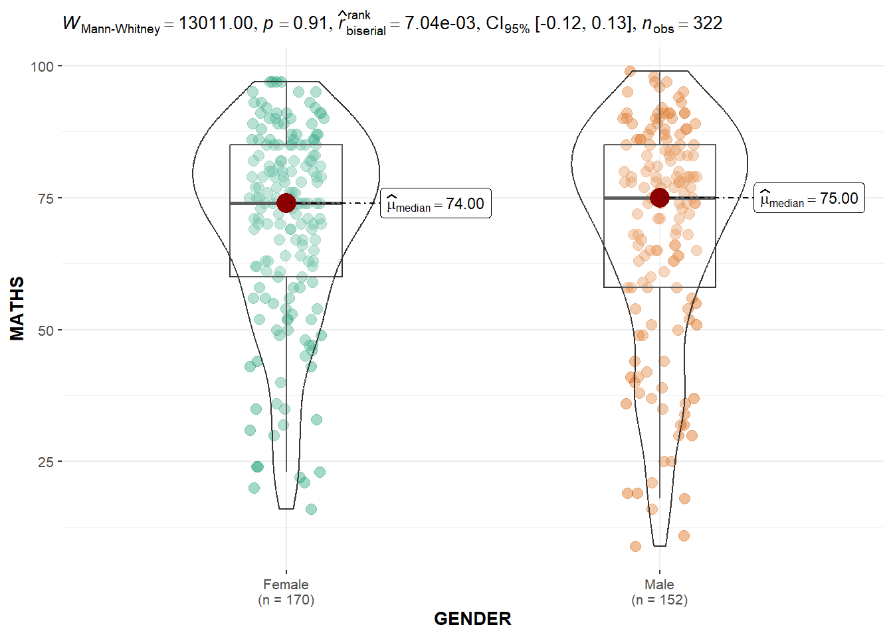
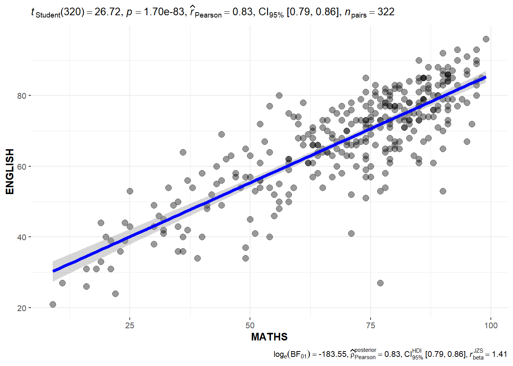
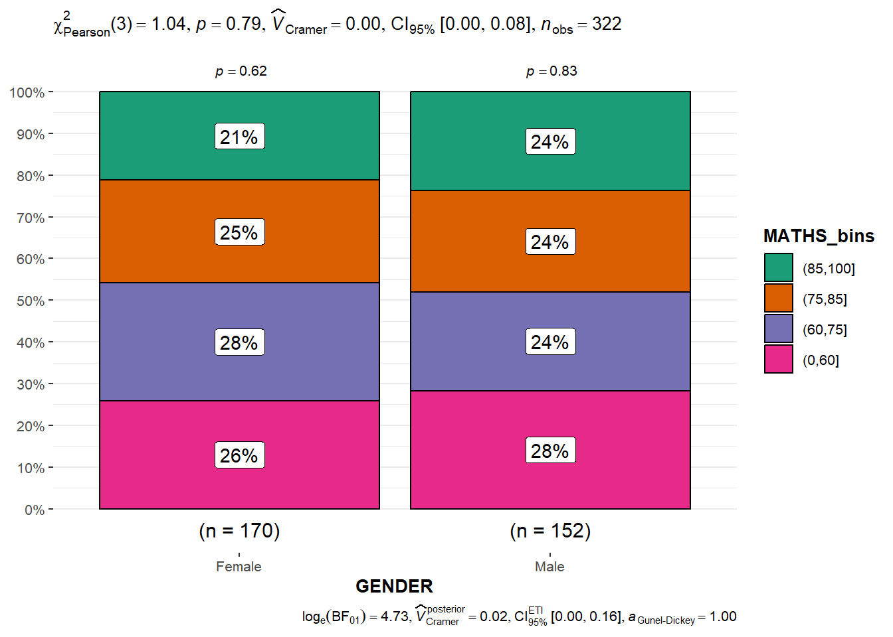

## **Visual Statistical Analysis**

## **1.1 Learning Outcome**

The following will be achieved:

1.  ggstatsplot package to create visual graphics with rich statistical information,

2.  performance package to visualise model diagnostics, and

3.  parameters package to visualise model parameters.

## **1.2 Visual Statistical Analysis with ggstatsplot**


## **1.3 Getting Started**

### **1.3.1 Install and launch R packages**

**ggstatsplot** and **tidyverse** will be used.

```{r}
pacman::p_load(ggstatsplot, tidyverse)
```

### **1.3.2 Import data**

The same data set from the previous exercises, *Exam_data.csv,* will be used.

```{r}
library(tidyverse)
exam <- read_csv("data/Exam_data.csv")
```

### **1.3.3 One-sample test: *gghistostats()* method**

[*gghistostats()*](https://indrajeetpatil.github.io/ggstatsplot/reference/gghistostats.html) is used to to build an visual of one-sample test on English scores.

```{r}
set.seed(1234)

gghistostats(
  data = exam,
  x = ENGLISH,
  type = "bayes",
  test.value = 60,
  xlab = "English scores"
)
```


### 1.3.4 Unpacking the Bayes Factor

Bayes factor is the ratio of the likelihood of one particular hypothesis to the likelihood of another.

That’s because the Bayes factor gives us a way to evaluate the data in favor of a null hypothesis, and to use external information to do so. It tells us what the weight of the evidence is in favor of a given hypothesis.

When we are comparing two hypotheses, H1 (the alternate hypothesis) and H0 (the null hypothesis), the Bayes Factor is often written as B10. It can be defined mathematically as:


The [**Schwarz criterion**](https://www.statisticshowto.com/bayesian-information-criterion/) is one of the easiest ways to calculate rough approximation of the Bayes Factor.

### **1.3.5 How to interpret Bayes Factor**

A **Bayes Factor** can be any positive number. One of the most common interpretations is this:


### **1.3.6 Two-sample mean test: *ggbetweenstats()***

[*ggbetweenstats()*](https://indrajeetpatil.github.io/ggstatsplot/reference/ggbetweenstats.html) is used to build a visual for two-sample mean test of Maths scores by gender.

```{r}
ggbetweenstats(
  data = exam,
  x = GENDER, 
  y = MATHS,
  type = "np",
  messages = FALSE
)
```



Default information: - statistical details - Bayes Factor - sample sizes - distribution summary

### **1.3.7 Oneway ANOVA Test: *ggbetweenstats()* method**

[*ggbetweenstats()*](https://indrajeetpatil.github.io/ggstatsplot/reference/ggbetweenstats.html) is used to build a visual for One-way ANOVA test on English score by race.

```{r}
ggbetweenstats(
  data = exam,
  x = RACE, 
  y = ENGLISH,
  type = "p",
  mean.ci = TRUE, 
  pairwise.comparisons = TRUE, 
  pairwise.display = "s",
  p.adjust.method = "fdr",
  messages = FALSE
)
```


-   “ns” → only non-significant

-   “s” → only significant

-   “all” → everything

#### 13.7.1 ggbetweenstats - Summary of tests


### **1.3.8 Significant Test of Correlation: *ggscatterstats()***

[*ggscatterstats()*](https://indrajeetpatil.github.io/ggstatsplot/reference/ggscatterstats.html) is used to build a visual for Significant Test of Correlation between Maths scores and English scores.

```{r}
ggscatterstats(
  data = exam,
  x = MATHS,
  y = ENGLISH,
  marginal = FALSE,
  )
```



### **1.3.9 Significant Test of Association (Depedence) : *ggbarstats()* methods**

The Maths scores is binned into a 4-class variable by using [*cut()*](https://www.rdocumentation.org/packages/base/versions/3.6.2/topics/cut).

```{r}
exam1 <- exam %>% 
  mutate(MATHS_bins = 
           cut(MATHS, 
               breaks = c(0,60,75,85,100))
)
```

[*ggbarstats()*](https://indrajeetpatil.github.io/ggstatsplot/reference/ggbarstats.html) is used to build a visual for Significant Test of Association.

```{r}
ggbarstats(exam1, 
           x = MATHS_bins, 
           y = GENDER)
```


